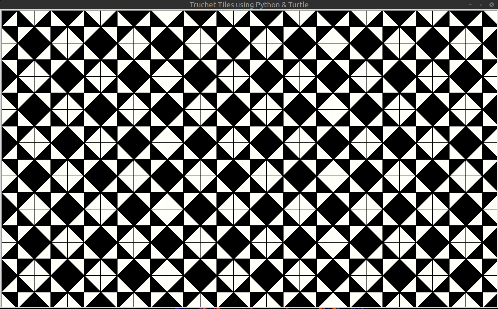
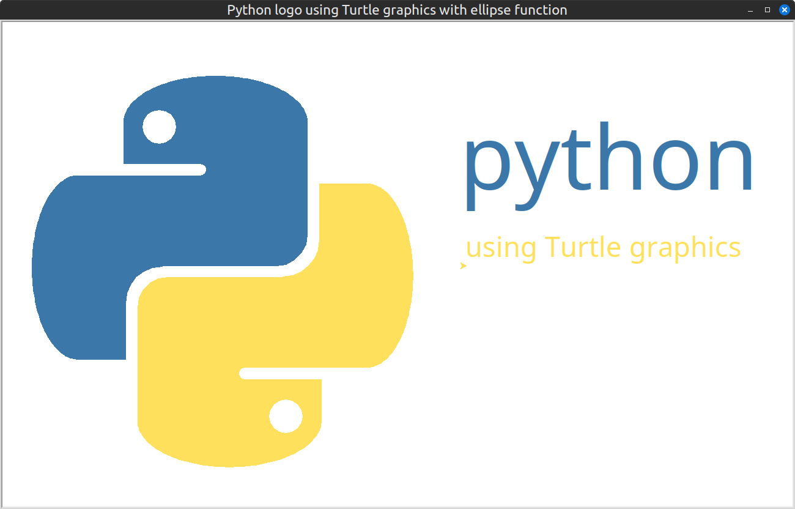
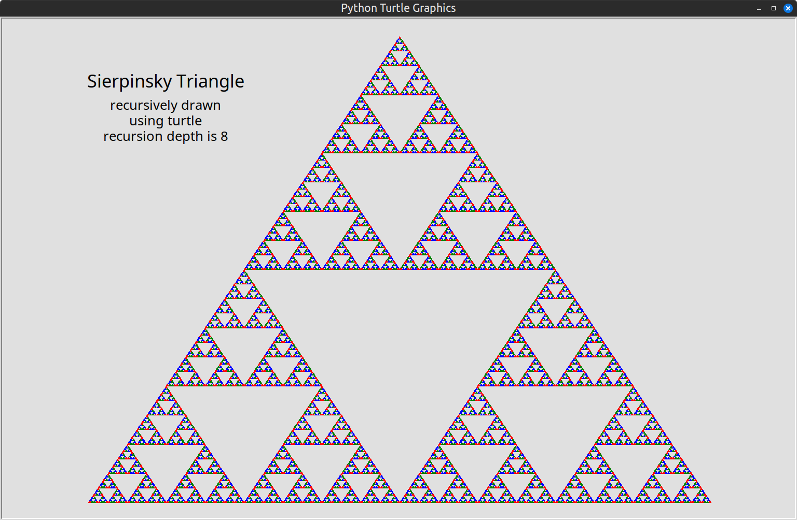

# Python-and-Turtle
Projects using CPython and Turtle graphics

## truchet_tiles2.py

code:

This script shows a series of patterns of Truchet Tiles.

The tiles are drawn using the Turtle libary. All patters are made from 4 different tiles.

The patterns are defined as rows and columns of tile numbers, for this nested tuples are used:

    pattern_X = (
        (2,4,3,4,4,2),
        (2,1,2,2,4,4),
        (3,4,4,2,2,4),
        (2,2,4,4,2,1),
        (4,2,2,4,3,4),
        (4,4,2,1,2,2)
        )

## truchet_tiles2_random.py

Randomly generated Truchet Tiles using complementery tiles for pleasing result.

code of version which loops automatically through random patterns, mouse click stops script:

code of version which saves pattern to text file when <a> key is pressed, loops to next random patterns with mouse click:

## turtle_python_logo.py

This script defines a fucntion to draw an ellipse using Turtle graphics.

Turtle graphics does have a circle function but no ellipse.

The ellipse function is then used to draw a python logo suing Turtle graphics.

## sierpinsky_turtle_cpython.py

code:

This script draws a Sierpinsky triangle recursively using turtle. 

This one makes use extra functionality in CPython's turtle on the PC, such as drawing filled shapes. 

The code shows several triangles using  successively deeper recursion.
