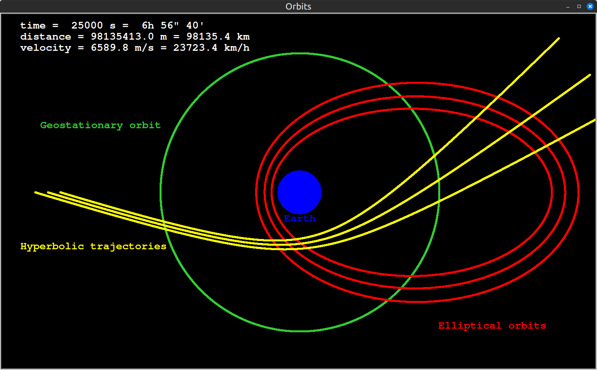
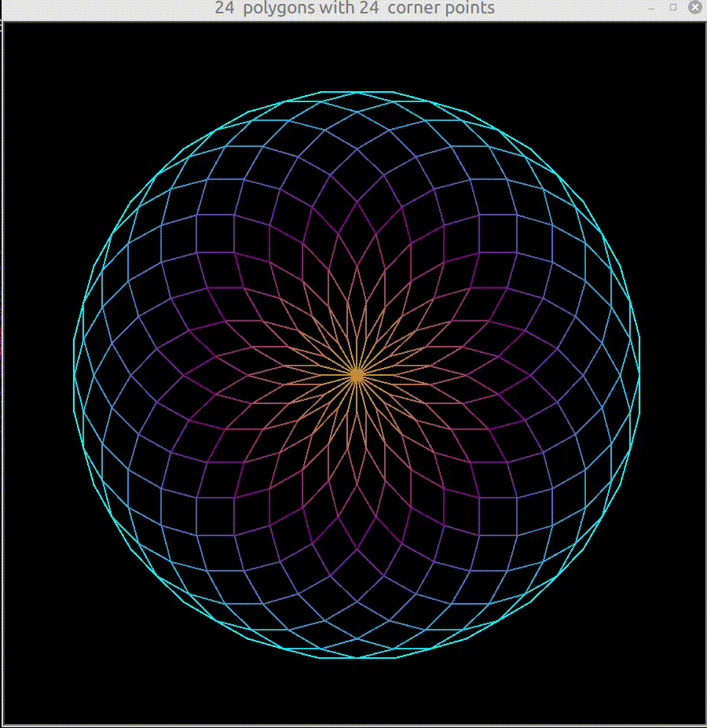

# Python-and-Turtle
Projects using CPython and Turtle graphics

* [tree_turtle_random2.py](https://github.com/oonap0oo/Python-and-Turtle#recursive_tree_turtle_random2py)
This script draws recursively generated trees. A lot of the tree's parameters have random variation.
* [truchet_tiles2.py](https://github.com/oonap0oo/Python-and-Turtle#truchet_tiles2py)
This script shows a series of patterns of Truchet Tiles.The tiles are drawn using the Turtle libary. All patterns are made from 4 different tiles.
* [truchet_tiles2_random.py](https://github.com/oonap0oo/Python-and-Turtle#truchet_tiles2_randompy)
Randomly generated Truchet Tiles using complementery tiles for pleasing result.
* [spiral.py](https://github.com/oonap0oo/Python-and-Turtle#spiralpy)
An animated spiral effect using Turtle graphics
* [turtle_python_logo.py](https://github.com/oonap0oo/Python-and-Turtle#turtle_python_logopy)
This script defines a fucntion to draw an ellipse using Turtle graphics. Turtle graphics does have a circle function but no ellipse. The ellipse function is then used to draw a python logo suing Turtle graphics.
* [sierpinsky_turtle_cpython.py](https://github.com/oonap0oo/Python-and-Turtle#sierpinsky_turtle_cpythonpy)
This script draws a Sierpinsky triangle recursively using turtle.
* [phyllotaxis2.py](https://github.com/oonap0oo/Python-and-Turtle#phyllotaxis2py)
This script produces images generated using the Vogel formula coming from the field of Phyllotaxis. It shows combinations of symbols and color sets.
* [orbits.py](https://github.com/oonap0oo/orbitspy) This code calculates and draws some trajectories of objects around the earth. The orbits are calculated from the acceleration based on Newton's law of universal gravitation
* [polygon2.py](https://github.com/oonap0oo/polygon2py) This code displays an animated image consisting of sets of polygons. The number of polygons as well as their number of corner points are increased and descreased. 

## [recursive_tree_turtle_random2.py](recursive_tree_turtle_random2.py)

This script draws recursively generated trees. 

A lot of the tree's parameters have random variation. 

The code uses Turtle graphics for drawing and the timer function.

## [truchet_tiles2.py](truchet_tiles2.py)

This script shows a series of patterns of Truchet Tiles.

The tiles are drawn using the Turtle libary. All patters are made from 4 different tiles.

The patterns are defined as rows and columns of tile numbers, for this nested tuples are used:

    pattern_X = (
        (2,4,3,4,4,2),
        (2,1,2,2,4,4),
        (3,4,4,2,2,4),
        (2,2,4,4,2,1),
        (4,2,2,4,3,4),
        (4,4,2,1,2,2)
        )

## [truchet_tiles2_random.py](truchet_tiles2_random.py)

Randomly generated Truchet Tiles using complementery tiles for pleasing result.

code of version which loops automatically through random patterns, mouse click stops script:

code of version which saves pattern to text file when <a> key is pressed, loops to next random patterns with mouse click:

## [spiral.py](spiral.py)

An animated spiral effect using Turtle graphics

## [turtle_python_logo.py](turtle_python_logo.py)

This script defines a fucntion to draw an ellipse using Turtle graphics.

Turtle graphics does have a circle function but no ellipse.

The ellipse function is then used to draw a python logo suing Turtle graphics.

## [sierpinsky_turtle_cpython.py](sierpinsky_turtle_cpython.py)

This script draws a Sierpinsky triangle recursively using turtle. 

This one makes use extra functionality in CPython's turtle on the PC, such as drawing filled shapes. 

The code shows several triangles using  successively deeper recursion.

## [phyllotaxis2.py](phyllotaxis2.py)

This script produces images generated using the Vogel formula coming from the field of Phyllotaxis.

    φ = n * 137.5
    r = c * √n
    n: index of element
    c: constant
    r: radius
    φ: azimith

It shows combinations of symbols and color sets.

## [orbits.py](orbits.py)

This code calculates and draws some trajectories of objects around the earth in two dimensions x,y

*  Geostationary orbit
*  Elliptical orbits
*  Hyperbolic trajectories

The orbits are calculated from the acceleration based on Newton's law of universal gravitation.

Newton's law of universal gravitation

    F = G * m1 * m2 / r**2

On an object in orbit

    F_attraction = - G * mass_earth * mass_object / r_distance**2

(F in opposite direction of r)

Newton's second law of motion

    F = m.a => a = F / m
    => a_object = F_attraction / mass_object

Acelleration due to gravity

    => a_object = - G * mass_earth / r_distance**2

The code uses Turtle graphics for drawing.

Calculations are done just using the math library.

## [polygon2.py](polygon2.py)

This code displays an animated image consisting of sets of polygons. 

The number of polygons as well as their number of corner points are increased and descreased. 

Also the color of the segments is variable.

